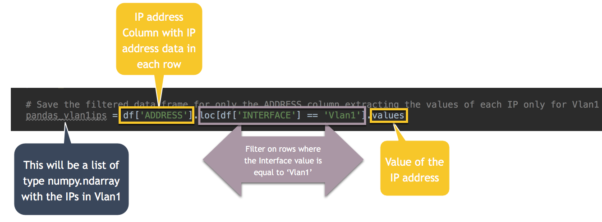
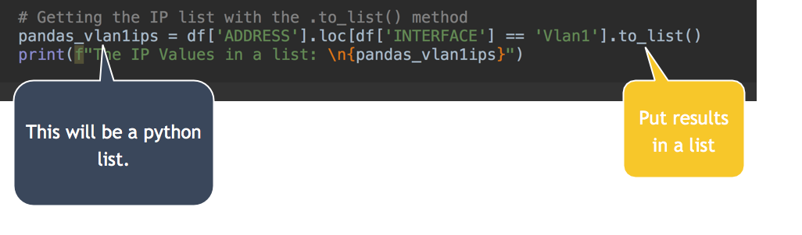

# Pandas for Network Engineers
(I mean...who doesn't love Pandas?)


### The module not the mammal! :panda_face:

My original title for this article was going to be ***Decomposing Pandas\*** as a follow on to ***[Decomposing Data Structures](https://gratuitous-arp.net/decomposing-complex-json-data-structures/)\*** but I was advised against that name.  Go figure.

One of the things I love most about Python is that it's always waiting for me to get just a little bit better so it can show me a slightly smarter way to do something.  Pandas is the latest such example.

Pandas is a powerful data science Python library that excels at manipulating multidimensional data.  

Why is this even remotely interesting to me as a network engineer? 

Well, that's what Excel does, right? 

I spend more time than I care to admit processing data in Excel.  I find that Excel is always the lowest common denominator.  I understand why and often I'm a culprit myself but eventually one grows weary of all the data being in a spreadsheet and having to manipulate it.  I'm working on the former and Pandas is helping on the latter.

Search around Google enough for help on processing spreadsheets and you will come across references to the Pandas Python module.

If you are anything like me, you go through some or all of these stages:

- You dismiss it as irrelevant to what you are trying to do
- You dismiss it because its seems to be about big data, analytics, and scientific analysis of data (not your thing right?)
- As you continue to struggle with what got you here in the first place (there has **got** to be a better way to deal with this spreadsheet data) you reconsider.  So you try to do some processing in Pandas and pull a mental muscle...and what the heck is this NaN thing that keeps making my program crash?  Basically, you find yourself way way out of your comfort zone (well..I did)!
- You determine that your limited Python skills are not up to something quite this complex...after all, you know just enough Python to do the automation stuff you need to do and you are not a data scientist.

Finally, in a fit of desperation as you see all the Excel files you have to process, you decide that a Python module is not going to get the better of you and you give it another go!

So here I am,  on the other side of that brain sprain, and better for it, as is usually the case.

### What is possible with Pandas...

Once you get the hang of it, manipulating spreadsheet-like data sets becomes so much simpler with Pandas. In fact, that is true for any data set, not just ones from spreadsheets.  In fact, in the examples below, the data set comes from parsing show commands with TextFSM.

Knowing how to work with Pandas, even in a limited fashion as is the case with me, is going to be a handy skill to have for any Network Engineer who is (or is trying to become) conversant in programmability & automation.  

My goal here is not to teach you Pandas as there is quite a lot of excellent material out there to do that. I've highlighted the content which helped me the most in the "[Study Guide](#study-guide)" section at the end.

My goal is to share what I've been able to do with it as a Network Engineer, what I found most useful as I tried to wrap my head around it, and my own Python REPL work. 

Let's look at something simple.  I need to get the ARP table from a device and "interrogate" the data.

In this example, I have a text file with the output of the "show ip arp" command which I've parsed with [TextFSM](https://gratuitous-arp.net/a-quick-example-of-using-textfsm-to-parse-data-from-cisco-show-commands-python3-version/).

Here is the raw data returned from the TextFSM parsing script:

```python
# Executing textfsm strainer function only to get data
strained, strainer = basic_textfsm.textfsm_strainer(template_file, output_file, debug=False)

In [1]: strained                                                        
Out[1]:
[['Internet', '10.1.10.1', '5', '28c6.8ee1.659b', 'ARPA', 'Vlan1'],
 ['Internet', '10.1.10.11', '4', '6400.6a64.f5ca', 'ARPA', 'Vlan1'],
 ['Internet', '10.1.10.10', '172', '0018.7149.5160', 'ARPA', 'Vlan1'],
 ['Internet', '10.1.10.21', '0', 'a860.b603.421c', 'ARPA', 'Vlan1'],
 ['Internet', '10.1.10.37', '18', 'a4c3.f047.4528', 'ARPA', 'Vlan1'],
 ['Internet', '10.10.101.1', '-', '0018.b9b5.93c2', 'ARPA', 'Vlan101'],
 ['Internet', '10.10.100.1', '-', '0018.b9b5.93c1', 'ARPA', 'Vlan100'],
 ['Internet', '10.1.10.102', '-', '0018.b9b5.93c0', 'ARPA', 'Vlan1'],
 ['Internet', '71.103.129.220', '4', '28c6.8ee1.6599', 'ARPA', 'Vlan1'],
 ['Internet', '10.1.10.170', '0', '000c.294f.a20b', 'ARPA', 'Vlan1'],
 ['Internet', '10.1.10.181', '0', '000c.298c.d663', 'ARPA', 'Vlan1']]
```

> [!NOTE]
> Don't read anything into the variable name **strained**.  The function I use
> to parse the data is called **textfsm_strainer** because I "strain" the data
> through TextFSM to get structured data out of it so I put the resulting parsed
> data from that function into a variable called "strained".

Here is that data in a Pandas Data Frame:

```python
# strained is the parsed data from my TextFSM function and the first command below
# loads that parsed data into a Pandas Data Frame called "df"

In [1]: df = pd.DataFrame(strained, columns=strainer.header)                                                                                                 
In [2]: df                                                                                             
Out[2]: 
    PROTOCOL         ADDRESS  AGE             MAC  TYPE INTERFACE
0   Internet       10.1.10.1    5  28c6.8ee1.659b  ARPA     Vlan1
1   Internet      10.1.10.11    4  6400.6a64.f5ca  ARPA     Vlan1
2   Internet      10.1.10.10  172  0018.7149.5160  ARPA     Vlan1
3   Internet      10.1.10.21    0  a860.b603.421c  ARPA     Vlan1
4   Internet      10.1.10.37   18  a4c3.f047.4528  ARPA     Vlan1
5   Internet     10.10.101.1    -  0018.b9b5.93c2  ARPA   Vlan101
6   Internet     10.10.100.1    -  0018.b9b5.93c1  ARPA   Vlan100
7   Internet     10.1.10.102    -  0018.b9b5.93c0  ARPA     Vlan1
8   Internet  71.103.129.220    4  28c6.8ee1.6599  ARPA     Vlan1
9   Internet     10.1.10.170    0  000c.294f.a20b  ARPA     Vlan1
10  Internet     10.1.10.181    0  000c.298c.d663  ARPA     Vlan1
```

I now have a spreadsheet like data structure with columns and rows that I can query and manipulate.

------

My first question:

##### *What are all the IPs in Vlan1?*

### Just Python

Before Pandas,  I would initialize an empty list to hold the one or more IPs and then I would iterate through the data structure (**strained** in this example) and where the interface "column" value (which in this list of lists in the **strained** variable is at index 5) was equal to 'Vlan1' I appended that IP to the list. The IP is in index 1 in each item the **strained** list.

```python
# Using Python Only
print("\n\tUsing Python only..")
vlan1ips = []
for line in strained:
    if line[5] == 'Vlan1':
        vlan1ips.append(line[1])
print(f"{vlan1ips}")
```

The resulting output would look something like this:

```python
['10.1.10.1', '10.1.10.11', '10.1.10.10', '10.1.10.21', '10.1.10.37',
'10.1.10.102', '71.103.129.220', '10.1.10.170', '10.1.10.181']
```

### Python and Pandas

Using a Pandas data frame **df** to hold the parsed data:

```python
pandas_vlan1ips = df['ADDRESS'].loc[df['INTERFACE'] == 'Vlan1'].values
```

The resulting output from the one liner above would look something like this:

```python
 ['10.1.10.1' '10.1.10.11' '10.1.10.10' '10.1.10.21' '10.1.10.37'
 '10.1.10.102' '71.103.129.220' '10.1.10.170' '10.1.10.181']
```

Same output with a single command!

### Python List Comprehension

For those more conversant with Python, you could say that list comprehension is just as efficient.

```python
# Using list comprehension
print("Using Python List Comprehension...")
lc_vlan1ips = [line[1] for line in strained if line[5] == 'Vlan1' ]
```

Results in:

```python
# Using List Comprehension: 
['10.1.10.1', '10.1.10.11', '10.1.10.10', '10.1.10.21', '10.1.10.37',
'10.1.10.102', '71.103.129.220', '10.1.10.170', '10.1.10.181']
```

So yes..list comprehension gets us down to one line but I find it a bit obscure to read and a week later I will have no idea what is in `line[5]` or `line[1]`.  

I could turn the data into a list of dictionaries so that rather than using the positional indexes in a list I could turn `line[1]` into `line['IP_ADDRESS']` and `line[5]` into `line['INTERFACE']` which would make reading the list comprehension and the basic Python easier but now we've added lines to the script.

Finally, Yes its one line but I'm still iterating over the data.

Pandas is set up to do all the iteration for me and lets me refer to data by name or by position "out of the box" and without any extra steps.

Let's decompose the one line of code:




If you think of this expression as a filter sandwich, the **`df['ADDRESS']`** and **`.values`** are the bread and the middle  **`.loc[df['INTERFACE']] == 'Vlan1']`** part that filters is the main ingredient.  

Without the middle part you would have a Pandas Series or list of all the IPs in the ARP table.   Basically you get the entire contents of the 'ADDRESS' column in the data frame without any filtering.  

When you "qualify" **`df['ADDRESS']`** with **`.loc[df['INTERFACE']] == 'Vlan1']`** you filter the ADDRESS column in the data frame for just those records where INTERFACE is 'Vlan1' and you only return the IP values by using the .values method.

Now, this will return a numpy.ndarray which might be great for some subsequent statistical analysis but as network engineers our needs are simple.

I'm using iPython in the examples below as you can see from the "In" and "Out" line prefixes.

```python
In [1]: pandas_vlan1ips = df['ADDRESS'].loc[df['INTERFACE'] == 'Vlan1'].values
In [2]: type(pandas_vlan1ips)
Out[2]: numpy.ndarray
```

I would like my list back as an actual Python list and that is no problem for Pandas.



```python
In [3]: pandas_vlan1ips = df['ADDRESS'].loc[df['INTERFACE'] == 'Vlan1'].to_list()
In [4]: type(pandas_vlan1ips)
Out[4]: list
In [5]: pandas_vlan1ips
Out[5]:
['10.1.10.1',
 '10.1.10.11',
 '10.1.10.10',
 '10.1.10.21',
 '10.1.10.37',
 '10.1.10.102',
 '71.103.129.220',
 '10.1.10.170',
 '10.1.10.181']
```

You know what would be really handy?  A list of dictionaries where I can reference both the IP ADDRESS and the MAC as keys.

```python
In [5]: vlan1ipmac_ldict = df[['ADDRESS', 'MAC']].to_dict(orient='records')
In [6]: type(vlan1ipmac_ldict)
Out[6]: list
In [7]: vlan1ipmac_ldict
Out[7]:
[{'ADDRESS': '10.1.10.1', 'MAC': '28c6.8ee1.659b'},
 {'ADDRESS': '10.1.10.11', 'MAC': '6400.6a64.f5ca'},
 {'ADDRESS': '10.1.10.10', 'MAC': '0018.7149.5160'},
 {'ADDRESS': '10.1.10.21', 'MAC': 'a860.b603.421c'},
 {'ADDRESS': '10.1.10.37', 'MAC': 'a4c3.f047.4528'},
 {'ADDRESS': '10.10.101.1', 'MAC': '0018.b9b5.93c2'},
 {'ADDRESS': '10.10.100.1', 'MAC': '0018.b9b5.93c1'},
 {'ADDRESS': '10.1.10.102', 'MAC': '0018.b9b5.93c0'},
 {'ADDRESS': '71.103.129.220', 'MAC': '28c6.8ee1.6599'},
 {'ADDRESS': '10.1.10.170', 'MAC': '000c.294f.a20b'},
 {'ADDRESS': '10.1.10.181', 'MAC': '000c.298c.d663'}]
In [8]: len(vlan1ipmac_ldict)
Out[8]: 11
```

​                                                       

### MAC address Lookup

Not impressed yet.  Let see what else we can do with this Data Frame.

I have a small function that performs MAC address lookups to get the Vendor OUI.

This function is called **`get_oui_macvendors()`** and you pass it a MAC address and it returns the vendor name.

It uses the [MacVendors.co](https://macvendors.co/) API.

I'd like to add a column of data to our Data Frame with the Vendor OUI for each MAC address.

In the one line below, I've added a column to the data frame titled 'OUI' and populated its value by performing a lookup on each MAC and using the result from the get_oui_macvendors function.

```python
df['OUI'] = df['MAC'].map(get_oui_macvendors)
```

The left side of the equation references a column in the data Fram which does not exist so it will be added.

The right side takes the existing MAC column in the data frame and takes each MAC address and runs it through the get_oui_macvendors function to get the Vendor OUI and "maps" that result into the new OUI "cell" for that MACs row in the data frame.


Now we have an updated Data Frame with a new OUI column giving the vendor code for each Mac.

```python
In [10]: df                                                                                            
Out[10]:
    PROTOCOL         ADDRESS  AGE             MAC  TYPE INTERFACE                 OUI
0   Internet       10.1.10.1    5  28c6.8ee1.659b  ARPA     Vlan1             NETGEAR
1   Internet      10.1.10.11    4  6400.6a64.f5ca  ARPA     Vlan1           Dell Inc.
2   Internet      10.1.10.10  172  0018.7149.5160  ARPA     Vlan1     Hewlett Packard
3   Internet      10.1.10.21    0  a860.b603.421c  ARPA     Vlan1         Apple, Inc.
4   Internet      10.1.10.37   18  a4c3.f047.4528  ARPA     Vlan1     Intel Corporate
5   Internet     10.10.101.1    -  0018.b9b5.93c2  ARPA   Vlan101  Cisco Systems, Inc
6   Internet     10.10.100.1    -  0018.b9b5.93c1  ARPA   Vlan100  Cisco Systems, Inc
7   Internet     10.1.10.102    -  0018.b9b5.93c0  ARPA     Vlan1  Cisco Systems, Inc
8   Internet  71.103.129.220    4  28c6.8ee1.6599  ARPA     Vlan1             NETGEAR
9   Internet     10.1.10.170    0  000c.294f.a20b  ARPA     Vlan1        VMware, Inc.
10  Internet     10.1.10.181    0  000c.298c.d663  ARPA     Vlan1        VMware, Inc.
```

### More questions

Let's interrogate our data set further.

I want a **unique lis**t of all the INTERFACE values.

```python
In [1]: df['INTERFACE'].unique()                                                         
Out[1]: array(['Vlan1', 'Vlan101', 'Vlan100'], dtype=object)
```

How about "Give me a **total count of each of the unique** INTERFACE values?"

```python
In [2]: df.groupby('INTERFACE').size()                                                         
Out[2]:INTERFACE
Vlan1      9
Vlan100    1
Vlan101    1
dtype: int64
```

Let's take it down a level and get **unique totals based on INTERFACE *and* vendor OUI**.

```python
In [3]: df.groupby(['INTERFACE','OUI']).size()                                                          
Out[3]:
INTERFACE  OUI
Vlan1      Apple, Inc.           1
           Cisco Systems, Inc    1
           Dell Inc.             1
           Hewlett Packard       1
           Intel Corporate       1
           NETGEAR               2
           VMware, Inc.          2
Vlan100    Cisco Systems, Inc    1
Vlan101    Cisco Systems, Inc    1
dtype: int64
```

I could do this all day long!

## Conclusion

I've just scratched the surface of what Pandas can do and I hope some of the examples I've shown above illustrate why investing in learning how to use data frames could be very beneficial.  Filtering, getting unique values with counts, even Pivot Tables are possible with Pandas.

Don't be discouraged by its seeming complexity like I was. 

Don't discount it because it does not seem to be applicable to what you are trying to do as a Network Engineer, like I did.  I hope I've shown how very wrong I was and that it is very applicable. 

In fact, this small example and some of the other content in this repository comes from an actual use case.

In 2019, I was involved in several large refresh projects and our workflow is what you would expect.  

1. Snapshot the environment before you change out the equipment  
2. Perform some basic reachability tests
3. Replace the equipment (switches in this case)
4. Perform basic reachability tests again
5. Compare PRE and POST state and confirm that all the devices you had just before you started are back on the network.
6. Troubleshoot as needed

As you can see if you delve into this repository, its heavy on ARP and MAC data manipulation so that we can automate most of the workflow I've described above.    Could I have done it without Pandas? Yes.  Could I have done it as quickly and efficiently with code that I will have some shot of understanding in a month without Pandas? No.

I hope I've either put Pandas on your radar as a possible tool to use in the future or actually gotten you curious enough to take the next steps. 

I really hope that the latter is the case and I encourage you to just dive in.  

This companion GitHub Repository is intended to help and give you examples.


------

## Next Steps

The "[Study Guide](#study-guide)" links below have some very good and clear content to get you started.  Of all the content out there, these resources were the most helpful for me.  

Let me also say that it took a focused effort to get the point where I was doing useful work with Pandas and like I said, I've only just scratched the surface.  There is no doubt in my mind that it was worth the effort.

Once you've gone through the [Study Guide](#study-guide) links and any others that you have found, you can return to this repository to see examples. In particular, this repository contains a Python script called **arp_interrogate.py**.

It goes through loading the ARP data from the "show ip arp" command, parsing it, and creating a Pandas Data Frame.

It then goes through a variety of questions (some of which you have seen above) to show how the Data Frame can be "interrogated" to get to information that might prove useful.

There are comments throughout which are reminders for me and which may be useful to you.

The script is designed to run with data in the repository by default but you can pass it your own "show ip arp" output with the `-o` option.

Using the `-i` option will drop you into iPython with all of the data still in memory for you to use. This will allow you to interrogate the data in the Data Frame yourself.

If you would like to use it make sure you clone or download the repository and set up the expected environment which is documented in the [requirements.txt](requirements.txt) file.

Options for the **arp_interrogate.py** script:

```
(pandas) Claudias-iMac:pandas_neteng claudia$ python arp_interrogate.py -h
usage: arp_interrogate.py [-h] [-t TEMPLATE_FILE] [-o OUTPUT_FILE] [-v]
                          [-f FILENAME] [-s] [-i] [-c]

Script Description

optional arguments:
  -h, --help            show this help message and exit
  -t TEMPLATE_FILE, --template_file TEMPLATE_FILE
                        TextFSM Template File
  -o OUTPUT_FILE, --output_file OUTPUT_FILE
                        Full path to file with show command show ip arp output
  -v, --verbose         Enable all of the extra print statements used to
                        investigate the results
  -f FILENAME, --filename FILENAME
                        Resulting device data parsed output file name suffix
  -s, --save            Save Parsed output in TXT, JSON, YAML, and CSV Formats
  -i, --interactive     Drop into iPython
  -c, --comparison      Show Comparison

Usage: ' python arp_interrogate.py Will run with default data in the
repository'
(pandas) Claudias-iMac:pandas_neteng claudia$
```

## Study Guide

A Quick Introduction to the “Pandas” Python Library

https://towardsdatascience.com/a-quick-introduction-to-the-pandas-python-library-f1b678f34673

For me **this is the class that made all the other classes start to make sense**.

Note that this class is not Free.

[Pandas Fundamentals](https://app.pluralsight.com/courses/909c55b8-6855-477a-93b3-673a0c660ccf/table-of-contents) by [Paweł Kordek](https://app.pluralsight.com/profile/author/pawel-kordek) on [PluralSight ](https://app.pluralsight.com/library/)is exceptionally good. 

There is quite a lot to Pandas and it can be overwhelming (at least it was for me) but this course in particular got me working very quickly and explained things in a very clear way.


Python Pandas Tutorial 2: **Dataframe Basics** by codebasics <- good for Pandas operations and set_index

https://www.youtube.com/watch?v=F6kmIpWWEdU


Python Pandas Tutorial 5: Handle **Missing Data**: fillna, dropna, interpolate by codebasics

https://www.youtube.com/watch?v=EaGbS7eWSs0


Python Pandas Tutorial 6. Handle Missing Data: replace function by codebasics

https://www.youtube.com/watch?v=XOxABiMhG2U


[Real Python](https://realpython.com/) <- this is terrific resource for learning Python

There is a lot of content here. Explore at will. The two below I found particularly helpful.

https://realpython.com/search?q=pandas

- [Pandas GroupBy: Your Guide to Grouping Data in Python](https://realpython.com/pandas-groupby/)

- [Using Pandas and Python to Explore Your Dataset](https://realpython.com/pandas-python-explore-dataset/)

  

Intro to DataFrames by Joe James <--great 'cheatsheet'

 https://www.youtube.com/watch?v=e60ItwlZTKM  

------


### What others have shared...

* (archive.org) [Analyzing Wireshark Data with Pandas](https://web.archive.org/web/20221003035937/https://www.python4networkengineers.com/posts/wireshark/analyzing_wireshark_data_with_pandas/) by George Eleftheriou
  * [(original dead link)](https://www.python4networkengineers.com/posts/wireshark/analyzing_wireshark_data_with_pandas/)


------


##### Disclaimer ######

*THE SOFTWARE IS PROVIDED “AS IS”, WITHOUT WARRANTY OF ANY KIND, EXPRESS OR IMPLIED, INCLUDING BUT NOT LIMITED TO THE WARRANTIES OF MERCHANTABILITY, FITNESS FOR A PARTICULAR PURPOSE AND NON INFRINGEMENT. IN NO EVENT SHALL THE AUTHORS OR COPYRIGHT HOLDERS BE LIABLE FOR ANY CLAIM, DAMAGES OR OTHER LIABILITY, WHETHER IN AN ACTION OF CONTRACT, TORT OR OTHERWISE, ARISING FROM, OUT OF OR IN CONNECTION WITH THE SOFTWARE OR THE USE OR OTHER DEALINGS IN THE SOFTWARE.*
